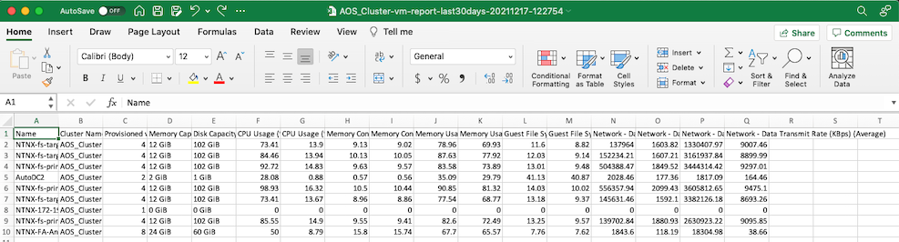

# Custom VM Stats Report in CSV

This script generates a CSV report based on VM statistics in the V1 API, which is accessed via Prism Element. It creates a report with the following columns:

* Name
* Cluster Name
* Provisioned vCPUs
* Memory Capacity
* Disk Capacity
* CPU Usage (%) (Max)
* CPU Usage (%) (Average)
* Memory Consumed (GiB) (Max)
* Memory Consumed (GiB) (Average)
* Memory Usage (%) (Max)
* Memory Usage (%) (Average)
* Guest File System Utilization (%) (Max)
* Guest File System Utilization (%) (Average)
* Network - Data Receive Rate (KBps) (Max)
* Network - Data Receive Rate (KBps) (Average)
* Network - Data Transmit Rate (KBps) (Max)
* Network - Data Transmit Rate (KBps) (Average)

By default, it will generate a report based on the last 30 days. The `-d` flag can be used to specify a duration in days (which can be `0` if you want a current point-in-time report)

## Setup

* Recommend Python version 3.7 or later. Testing for this script was done with Python 3.7.11 on Mac OS X Catalina.
* Create an activate a virtual environment:

```
python3 -m venv venv
. venv/bin/activate
```

* Install dependencies
```
pip3 install -r requirements.txt
```

## Usage
```
usage: vm_report.py [-h] [-u USERNAME] [-p PASSWORD] [-d DURATION]
                    [-f FILENAME]
                    pe_ip

positional arguments:
  pe_ip                 Prism Element IP address

optional arguments:
  -h, --help            show this help message and exit
  -u USERNAME, --username USERNAME
                        Prism Element username
  -p PASSWORD, --password PASSWORD
                        Prism Element password
  -d DURATION, --duration DURATION
                        Number of days to report on
  -f FILENAME, --filename FILENAME
                        Desired report filename
```

### Example Usage

```
python3 ./vm_report.py <Prism_Element_IP> -u <username> -p <password>
```
The Prism Element IP is the only required parameter, however you will be prompted for the username and password if they are not passed.

Without any additional flags, the default duration will be 30 days and the default report filename will be `<cluster_name>-vm-report-<date>.csv`

```
python3 ./vm_report.py <Prism_Element_IP> -u <username> -p <password> -d 60 -f myreport.csv
```
The above will gather data for the last 60 days and write to file `myreport.csv`

## Additional Info

### SSL connections
By default, this script does not require a verified SSL connection to Prism Element. If you have configured Prism Element with a valid SSL certificate and require SSL certificate verification in your environment, please comment the following line:

```
urllib3.disable_warnings(urllib3.exceptions.InsecureRequestWarning)
```

### Logs
Everything is logged to `<cluster_name>-log-<date>.log`
### API Calls

The following API calls are used in this script:

```
GET https://{pe_ip}:9440/PrismGateway/services/rest/v1/clusters
GET https://{pe_ip}:9440/PrismGateway/services/rest/v1/vms
GET https://{pe_ip}:9440/PrismGateway/services/rest/v1/vms/stats/?metrics={vm_metric}&startTimeInUsecs={startTimeInUsecs}
```

For more information, take a look at this blog post: https://www.nutanix.dev/2019/09/23/getting-vm-performance-metrics-via-api/

### Attribute and Metric Configuration

The defined attributes and metrics are found in config.json, and mapped to a desired display name.

For additional attributes and metrics, please use `https://{pe_ip}:9440/PrismGateway/services/rest/v1/vms` to see a full list of attributes and metrics that can be queried.

### Supported AOS versions

This script was tested and verified working against:

* AOS 5.10.3.2
* AOS 5.20.1.1
* AOS 6.0.2

## Screenshots

Sample Log File


Sample Report Output



## Performance Benchmark

On a 14-node cluster with 375 total VMs the script took ~16 minutes to run.

## Disclaimer

Please see the .disclaimer file that is distributed with this repository.
